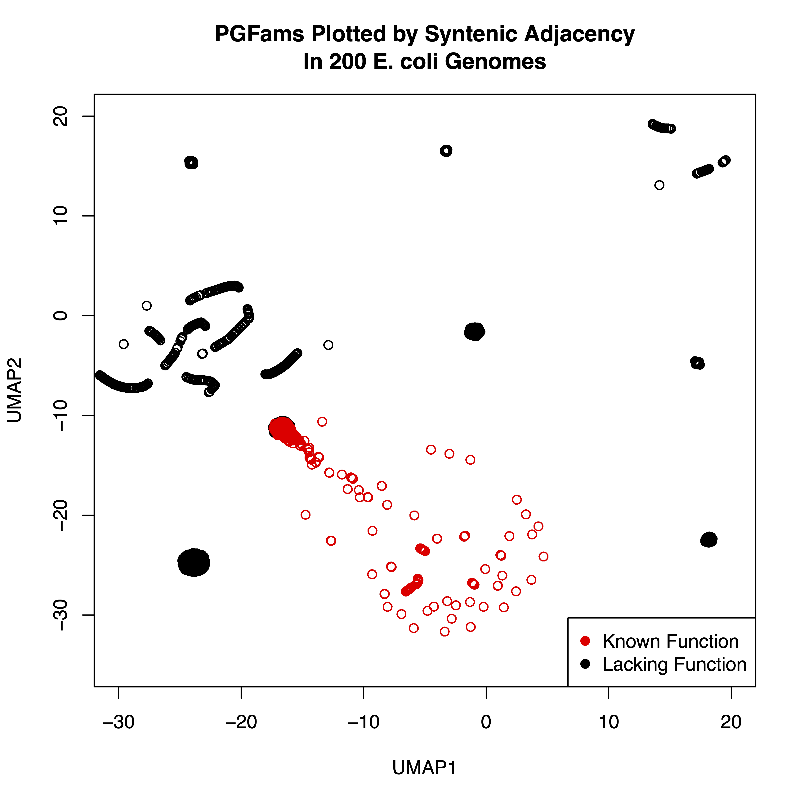
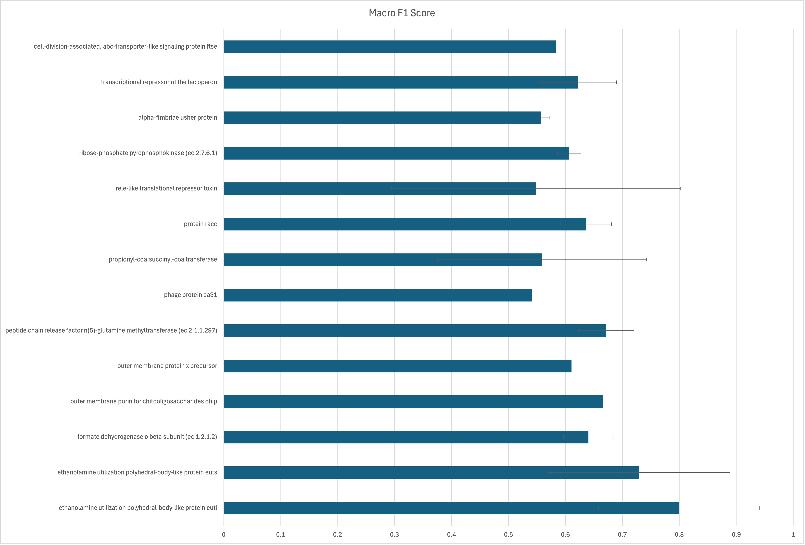
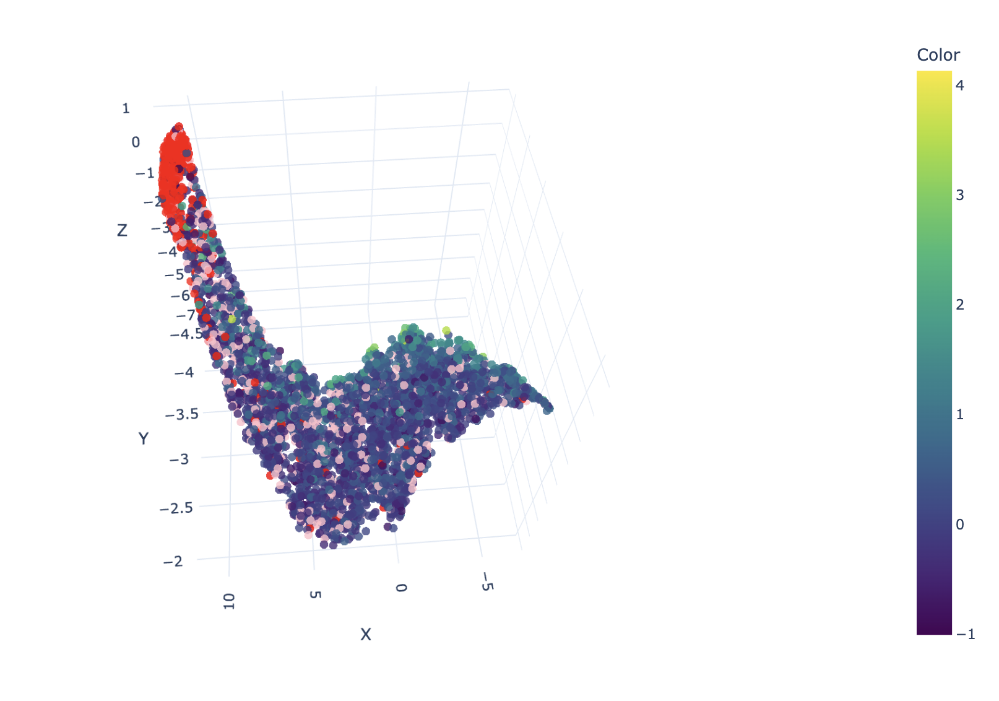

# Assigning Functions to Uncharacterized Genes

Leveraging machine learning and AI to predict functions of characterized and uncharacterized genes using K-mers, ensemble methods, and LLM embeddings

## About This Project

This is a project from the **NIAID BRC AI Codeathon 2025**, taking place November 12-14, 2025 at Argonne National Laboratory.

**Event Website:** https://niaid-brc-codeathons.github.io/

**Project Details:** https://niaid-brc-codeathons.github.io/projects/gene-function-prediction/

## Team

- Marcus Nguyen
- Jim Davis
- Chris Henry
- Gordon Pusch
- Ross Overbeek
- Allan Dickerman
- Gary Olsen
- Alex Brace
- Juston Podowski

## Codeathon Goals

The NIAID Bioinformatics Resource Centers (BRCs) invite researchers, data scientists, and developers to a three-day AI Codeathon focused on improving Findability, Accessibility, Interoperability, and Reusability (FAIR-ness) of BRC data and tools using artificial intelligence (AI) and large language models (LLMs).

The main goal of this project was to predict the function of uncharacterized genes by producing models to predict the function of characterized genes.  Model metrics tend to focus on a ground truth dataset to compute accuracy (F1, AUC, etc.).  A ground truth that maps uncharacterize genes to their characterization doesn't exist, so we decide to use a dataset that maps characterized genes to their characterizations and make predictions on that.  There is a small assumption that These models would in theory be able to be applied to uncharacterized genes.  

The main dataset consisted of a set of 36k E. coli genomes downloaded from the BV-BRC which contains over 8.8 million sequences covering over 5.5 thousand unique functional products.  

## Modeling Approaches

We planned to approach this problem from various avenues of attack with various people within the group working asynchronously on their own approaches to the problem.  

Due to the size of the datasets, the datasets themselves won't be available on this Github.  The code to generate the dataset is available in the *dataset* directory.

### Traditional Machine Learning

Utilizing traditional ML models using various feature sets that are fairly easy to vectorize, we can produce models to predict gene function.  

#### Codon Usage (Jim)

Jim used a tool that he had produced in the past to calculate codon usage.  It had been optimized to run faster.  The code to do this is in the *codon_usage* directory.  The paper for this tool is available (here)[https://academic.oup.com/mbe/article/28/1/211/980009].

#### Synteny and Gene Neighborhoods

Gordon, Ross, and Allan worked on computing some datasets for synteny and gene neighborhoods.  Their code currently takes a BV-BRC genome ID and computes all gene pairs.  Their code could be hacked to produce neighborhoods larger than 2. They computed neighborhoods for roughly 9k genomes during the codeathon.  Their code will be available in the *synteny* directory.  The code does require a proper setup of the BV-BRC runtime though.  

We were able to compute a UMAP that computed distances of various gene neighbors over 200 genomes and found that there definitely is some clustering between genes.  The UMAP shows that although not all genes cluster very well with respect to synteny; sets definitely cluster, however, the differences between known and lacking function groups is fairly large; there are some areas of overlap, however.  

#### NA K-mer Models (Marcus)

NA K-mers were computed and turned into a matrix.  Various script to sub-sample the entire space of sequences to test modeling.  The entire dataset is unable to fit into the memory of a machine with 1.5TB, so two "smaller" datasets were created that consisted of over 250k samples and 2.5M samples.  A one vs all approach was required to get the modeling to work due to unforeseen issues training the initial models.  Only a handful of the one vs all models have finished training on the 250k sample model.  Initial Macro F1 Scores are shown below.  

The scripts used to count k-mers is available in the *kmers* directory.  The script can be used to count both NA and AA k-mers crudely by commenting/uncommenting some code.

The code to actual train models was taken from [here](https://github.com/Tinyman392/GenomicModelCreator).  

#### GenSLM

Genome Scale Language Models are a family of NA sequence-based large language models.  The goal for this codeathon was to get them incorporated into Huggingface as it would prove to be extremely useful to finetune the model for not only this problem, but many others as well.  Unfortunately we ran into hiccups while getting it set up.  The GitHub for GenSLM is available (here)[https://github.com/ramanathanlab/genslm].  

He was able to show that the hypothetical proteins form a fairly large cluster in embedding space while the uncharacterized genes distribute pretty over the embedding space.  

#### Pangenome Metadata

Chris had started trying to generate a huge vector of metadata over the pangenome to connect to an AI to predict function.  These features included:
- Gene neighborhood
- RAST
- Fetch uniprot and structure and closest PDB with cocrystalization
- Annotate domain
- Pangenomic context
- Environment mapping
- How conserved is the context
- Test for phage
- Codon usage
- Metabolic functions (modeling)
- Rank functions-based context
- Membrane vs cytosolic (cellular localization)
- DNA binding domains
- Horizontal transfer
- Accessory genes
- Mutant growth data

Some of these features did overlap with the features produced in other approaches.  He had completed getting pangenome and mutant growth data.  

## License

*To be determined by the team.*
